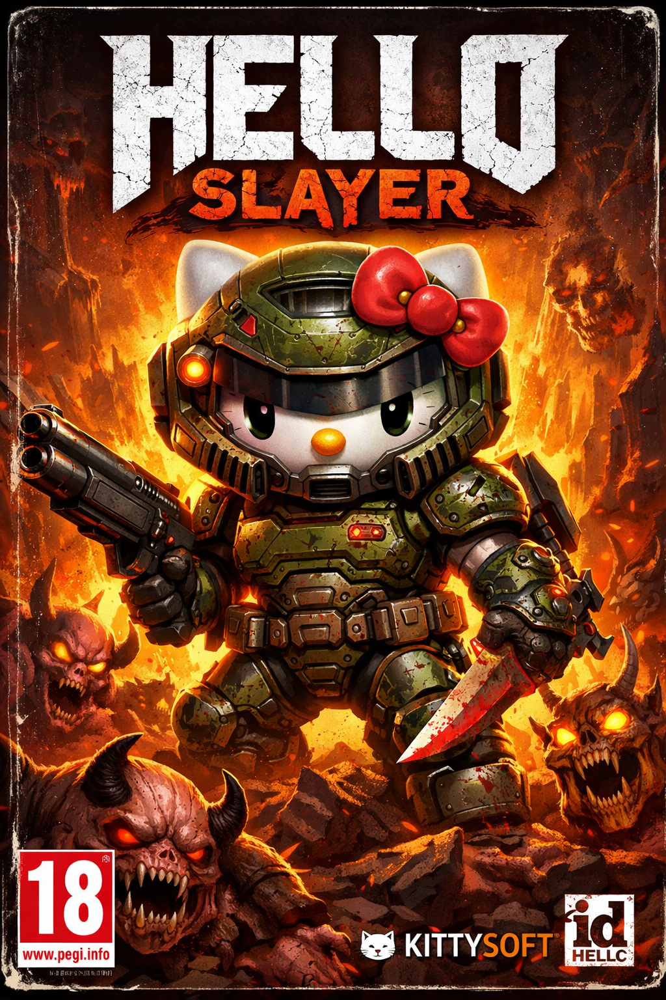

# 🗡️ HELLO SLAYER 64

**HELLO SLAYER 64** est un jeu d'action-survie en 3D au style rétro-brutal, développé avec **Three.js**. Affrontez des vagues infinies d'ennemis, gérez votre montée en puissance et survivez dans une arène obscure baignée de néons rouges.

  
  

  <video src="assets/images/generated/grok-video-ec44c7fe-811d-49ef-a3af-311bd5069809.mp4" width="100%" autoplay loop muted inline>
  </video>

---

## 🎮 Commandes

Le jeu utilise un système de contrôle à la première/troisième personne avec verrouillage du pointeur de la souris.

| Action | Touche / Commande |
| :--- | :--- |
| **Déplacement** | `Z` `Q` `S` `D` (ou `W` `A` `S` `D`) |
| **Saut** | `Espace` (Multi-sauts possibles via upgrades) |
| **Attaque Horizontale** | `Clic Gauche` |
| **Attaque Verticale** | `Clic Droit` |
| **Caméra** | `Souris` |

---

## ✨ Caractéristiques du Jeu

### 📈 Système de Progression (RPG)
* **Gain d'XP** : Éliminez des ennemis pour remplir votre barre d'XP turquoise.
* **Level Up** : À chaque niveau, le temps s'arrête pour vous laisser choisir un bonus.
* **Améliorations** : Choisissez entre la **Vitesse (+15%)** ou l'**Agilité (+1 saut)**.

### 👾 Ennemis & Vagues
* **Vagues Infinies** : La difficulté augmente à chaque vague nettoyée.
* **Types d'ennemis** : Comprend des ennemis normaux, des unités volantes rapides et des **Boss massifs** toutes les 5 vagues.
* **Barres de vie** : Chaque entité possède une barre de santé dynamique au-dessus d'elle.

### 🎁 Bonus & Power-ups
Des bonus apparaissent aléatoirement ou après la défaite d'un boss :
* **Épée Longue (Jaune)** : Augmente la portée de vos attaques pendant 15 secondes.
* **Bouclier (Bleu)** : Invoque trois orbes protecteurs qui infligent des dégâts au contact.
* **Allié (Violet)** : Invoque un compagnon qui tire des projectiles laser sur vos cibles.

---

## 🛠️ Installation

1. Clonez ce dépôt sur votre machine.
2. Lancez le fichier `index.html` via un serveur local (ex: extension *Live Server* sur VS Code) pour éviter les blocages de sécurité du navigateur liés au chargement des scripts.

---

## 💻 Technologies Utilisées

* **Three.js** : Moteur de rendu 3D WebGL.
* **JavaScript (Vanilla)** : Logique de jeu, système de collision et IA.
* **CSS3** : Interface utilisateur (UI) et animations "pulse".
* **HTML5 Canvas** : Pour les barres de vie dynamiques.

---

**Prêt à entrer dans l'enfer ?** Cliquez sur "ENTRER DANS L'ENFER" et survivez le plus longtemps possible !
